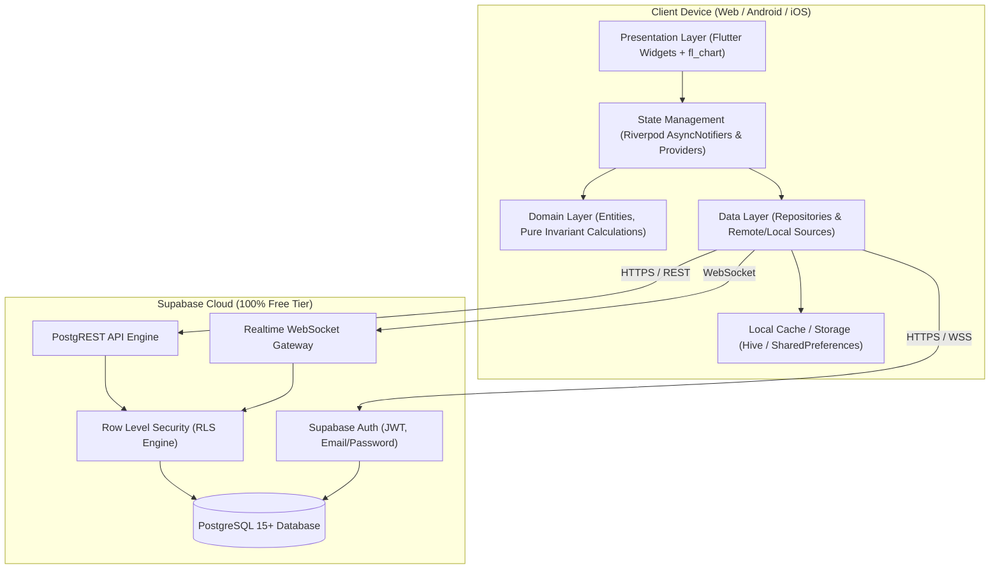
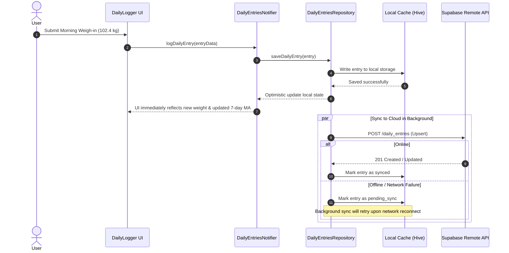
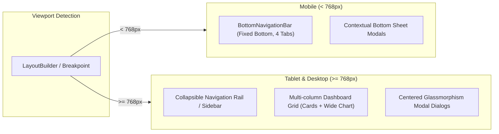
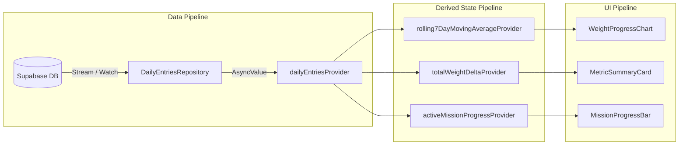
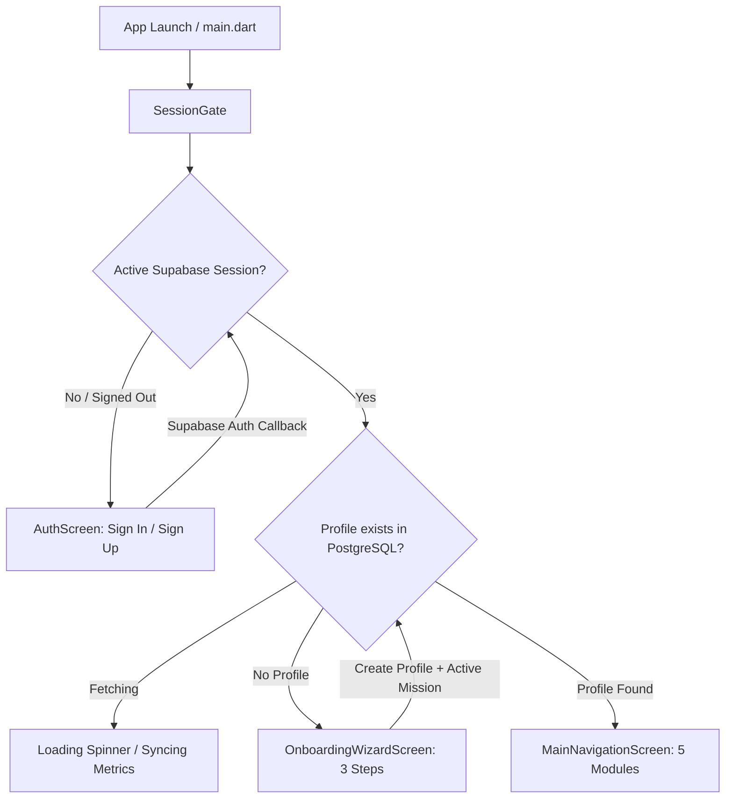

# PandaFit — System Architecture & Technical Blueprint (`ARCHITECTURE.md`)

This document provides a comprehensive technical breakdown of the **PandaFit** cross-platform application architecture, state pipelines, offline-first data synchronization, navigation models, and design tokens.

---

## 1. High-Level System Architecture

PandaFit uses a **Feature-First Clean Architecture** built on Flutter (Client) and Supabase (Backend Cloud Engine), designed for zero operational cost and complete cross-platform fidelity (Web, Android, iOS).



---

## 2. Layered Architecture (Clean / Feature-First)

Every functional module inside `lib/features/` follows strict separation of concerns:

```
feature_name/
├── domain/                  # PURE DART — Zero external Flutter dependencies
│   ├── models/              # Immutable Data Classes / Entities
│   ├── value_objects/       # Types with built-in validation (e.g., WeightValue)
│   └── calculations/        # Pure algorithmic engines (7-day MA, Mission inequality)
├── data/                    # Data sources, serialization, network mapping
│   ├── datasources/         # SupabaseClient remote calls & local storage adapters
│   ├── dtos/                # Data Transfer Objects (from/to JSON)
│   └── repositories/        # Repository implementations with offline-first fallback
└── presentation/            # User Interface & Reactive State
    ├── controllers/         # Riverpod Notifiers (AsyncNotifier, StateNotifier)
    ├── screens/             # Top-level screen views (Responsive web/mobile)
    └── widgets/             # Reusable, feature-specific UI components
```

### Layer Rules
1. **Domain Layer:** Pure Dart only. No imports of `flutter/material.dart` or `supabase_flutter`. This ensures 100% unit-testability without mocks.
2. **Data Layer:** Handles network calls, offline caching, and DTO-to-Domain mapping. Catches Supabase PostgREST exceptions and transforms them into domain failures.
3. **Presentation Layer:** Watches Riverpod providers. Reacts declaratively to `AsyncValue.loading()`, `AsyncValue.error()`, and `AsyncValue.data()`.

---

## 3. Data Flow & Offline-First Strategy

To ensure seamless operation even without network access (e.g. morning weigh-in in an area with poor signal), PandaFit employs a **Cache-First Write-Through** pattern:



---

## 4. Navigation & Responsive Layout Architecture

PandaFit uses **GoRouter** with a responsive layout shell that dynamically adapts between mobile viewports and desktop/tablet screens:



### Core Route Tree
| Route Path | Screen View | Description |
| :--- | :--- | :--- |
| `/login` | `LoginScreen` | Supabase Auth (Email / Password & Magic Link). |
| `/dashboard` | `DashboardScreen` | Daily weight overview, 7-day MA chart, active mission status. |
| `/logger` | `DailyLoggerScreen` | Quick weigh-in, calories, dinner choice, swimming flag. |
| `/missions` | `MissionsHubScreen` | Active mission tracker, target distance, historical accomplished missions. |
| `/nutrition` | `NutritionGuideScreen` | Recipe cards, raw/dry weighing protocol, ingredients breakdown. |
| `/profile` | `ProfileScreen` | User statistics, height, age, read-only starting weight inspector. |

---

## 5. Security & Authentication Architecture

```mermaid
graph TD
    ClientApp["PandaFit Flutter Client"]
    AnonKey["Supabase Public Anon Key (Embedded in Client)"]
    AuthHeader["Bearer JWT Token (Stored in Secure Storage)"]
    SupabaseAuth["Supabase GoTrue Auth Service"]
    RLSEngine["PostgreSQL Row Level Security (RLS)"]
    UserData["Private User Rows in Database"]

    ClientApp -->|Public Requests| AnonKey
    AnonKey --> SupabaseAuth
    SupabaseAuth -->|Issues Session JWT| AuthHeader
    AuthHeader -->|Authenticated Queries| RLSEngine
    RLSEngine -->|auth.uid() = user_id| UserData
```

1. **Authentication:** Supabase Auth manages sessions. The client securely persists the session token via Flutter's `flutter_secure_storage` or encrypted shared preferences.
2. **Row Level Security (RLS):** Every query is executed under the context of `auth.uid()`. Even if an attacker inspects network traffic or intercepts client-side code, they cannot read or write another user's rows.
3. **Database Guardrails:** A PostgreSQL trigger (`check_profile_start_weight_lock`) rejects any database `UPDATE` modifying `profile_start_weight` if the user already has logged daily entries.

---

## 6. Design System Tokens & Aesthetics

PandaFit implements a modern, deep dark-mode theme utilizing glassmorphism and tailored semantic accents:

### 6.1 Color Palette
| Token Name | Hex Code | Purpose |
| :--- | :--- | :--- |
| `backgroundDark` | `#0A0F1D` | Deep slate/charcoal background canvas |
| `surfaceDark` | `#111827` | Primary card and container background |
| `surfaceGlass` | `rgba(30, 41, 59, 0.7)` | Translucent glassmorphism panels with 12px blur |
| `primaryEmerald` | `#10B981` | Accent color for healthy status, weight loss, and primary buttons |
| `secondaryCyan` | `#06B6D4` | Accent color for 7-day moving average, water, and swimming |
| `accentAmber` | `#F59E0B` | Calorie targets, warnings, and mission milestone flags |
| `accentRose` | `#F43F5E` | Caloric overage or weight spikes above baseline |
| `textPrimary` | `#F8FAFC` | High-contrast body and header text |
| `textSecondary` | `#94A3B8` | Subtle metadata, timestamps, and unit labels (`kg`, `kcal`) |

### 6.2 Responsive Breakpoints
* **Mobile (Compact):** `< 600 dp` — Single column, bottom navigation, card stacks.
* **Tablet (Medium):** `600 dp - 1024 dp` — 2-column grid, compact navigation rail.
* **Desktop / Web (Expanded):** `> 1024 dp` — Expansive multi-column dashboard, left fixed navigation bar, comprehensive interactive charts with hover indicators.

---

## 7. State Management Pipelines (Riverpod)



By computing moving averages and deltas through pure **derived Riverpod providers**, UI components never re-calculate complex math in their render trees, guaranteeing smooth 60fps animations and instant chart rendering.

---

## 8. Authentication & Onboarding Session Lifecycle

PandaFit uses a reactive **SessionGate** to orchestrate seamless authentication and onboarding transitions:



### Onboarding Invariant Enforcements:
1. **Starting Weight Immutability (`profile_start_weight`):** Set once during onboarding. Validated to `0.1 kg` precision. Trigger-locked in PostgreSQL once daily entries begin.
2. **First Mission Directionality:**
   - **Cutting:** Requires $\text{Target Weight} < \text{Start Weight}$.
   - **Bulking:** Requires $\text{Target Weight} > \text{Start Weight}$.
   - $\text{Target Weight} == \text{Start Weight}$ is strictly rejected at the validation layer.
3. **Dynamic Age Derivation:** Derived strictly from `birth_date` and calendar anniversary, never stored as a static integer.
